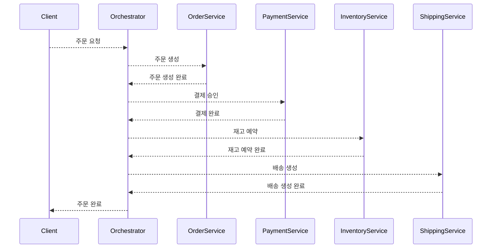
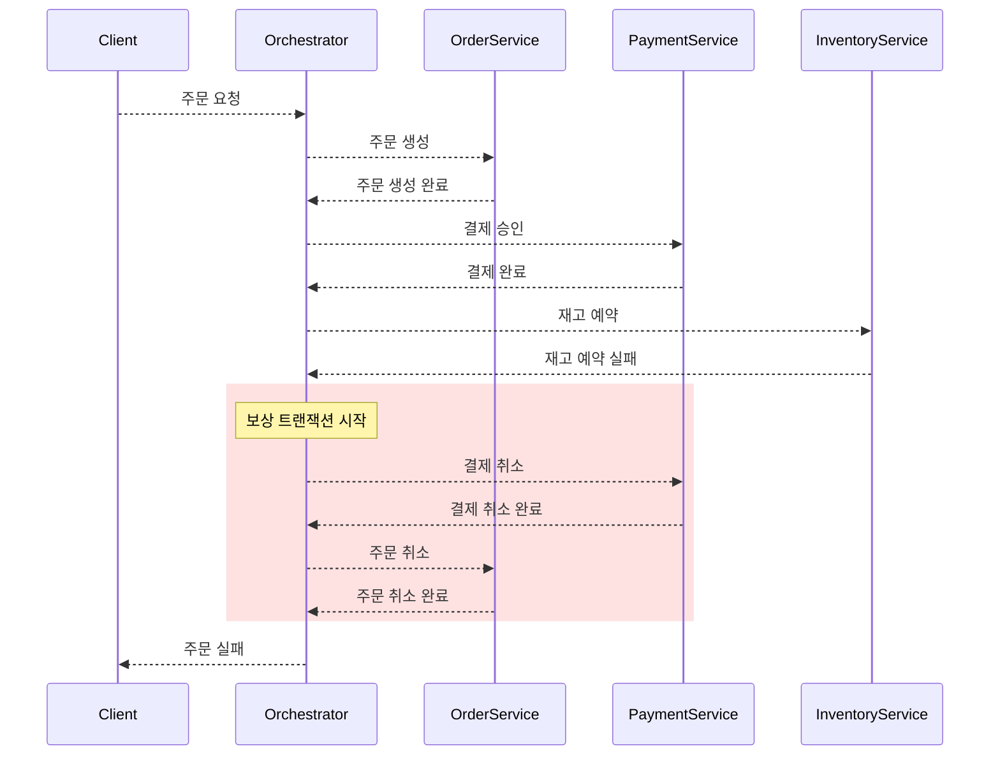

# SPEC — Saga Pattern Explorer (Technical Specification)

> PRD 기반 기술 명세서. MVP 범위를 기준으로 작성.

---

## 1. 프로젝트 구조

```
saga-pattern-3d-simulation/
├── docs/
│   ├── PRD.md
│   └── SPEC.md
├── public/
│   └── index.html
├── src/
│   ├── main.tsx                    # 엔트리 포인트
│   ├── App.tsx                     # 루트 컴포넌트 (레이아웃)
│   ├── components/
│   │   ├── cube/
│   │   │   ├── CubeScene.tsx       # R3F Canvas + 카메라/조명
│   │   │   ├── CubeEdges.tsx       # 큐브 와이어프레임 엣지 (선택 시 하이라이트)
│   │   │   ├── CubeSearch.tsx      # 패턴 검색 (/ 키보드 단축키)
│   │   │   ├── PatternNode.tsx     # 꼭짓점 노드 (구체 + 라벨 + 디밍)
│   │   │   └── AxisLabels.tsx      # 축 이름 라벨 (X/Y/Z, 선택 시 강조)
│   │   ├── detail/
│   │   │   ├── DetailPanel.tsx     # 패턴 상세 패널 컨테이너
│   │   │   ├── PatternInfo.tsx     # 패턴 기본 정보 (이름, 속성, 장단점)
│   │   │   ├── SequenceDiagram.tsx # Mermaid 시퀀스 다이어그램
│   │   │   └── FailureInjector.tsx # 실패 주입 버튼 그룹
│   │   └── layout/
│   │       ├── Header.tsx          # 상단 헤더
│   │       └── Legend.tsx          # 하단 범례 (축/색상)
│   ├── data/
│   │   ├── patterns.ts            # 8개 패턴 정적 데이터
│   │   └── scenarios.ts           # 패턴별 시퀀스 시나리오
│   ├── store/
│   │   └── useStore.ts            # Zustand 스토어
│   ├── types/
│   │   └── index.ts               # 타입 정의
│   └── utils/
│       └── mermaid.ts             # Mermaid 다이어그램 생성 유틸
├── .github/
│   └── workflows/
│       └── deploy.yml              # GitHub Pages 자동 배포
├── package.json
├── tsconfig.json
├── vite.config.ts
└── tailwind.config.js
```

---

## 2. 타입 정의

```ts
// src/types/index.ts

// 3축 속성
type Communication = "sync" | "async"
type Consistency = "atomic" | "eventual"
type Coordination = "orchestration" | "choreography"

// 복잡도/확장성 등급
type Grade = "low" | "medium" | "high"

// Saga 패턴
type SagaPattern = {
  id: string                    // "sao", "sac", "seo", "sec", "aao", "aac", "aeo", "aec"
  name: string                  // "Epic Saga", "Parallel Saga", ...
  communication: Communication
  consistency: Consistency
  coordination: Coordination
  description: string           // 한 줄 설명
  advantages: string[]
  disadvantages: string[]
  useCases: string[]            // 추천 사용 상황
  complexity: Grade
  scalability: Grade
  position: [number, number, number]  // 3D 큐브 좌표 [x, y, z]
}

// 시퀀스 다이어그램 관련
type StepActor = "Client" | "Orchestrator" | "OrderService" | "PaymentService" | "InventoryService" | "ShippingService"

type SagaStep = {
  from: StepActor
  to: StepActor
  action: string
  type: "command" | "event" | "compensation" | "response"
  isAsync: boolean
}

type FailurePoint = "payment" | "inventory" | "shipping"

type SagaScenario = {
  patternId: string
  happyPath: SagaStep[]
  failurePaths: Record<FailurePoint, SagaStep[]>
}

// 뷰 모드
type ViewMode = "happy" | "failure" | "combined"
```

---

## 3. 상태 관리 (Zustand Store)

```ts
// src/store/useStore.ts

type Theme = 'light' | 'dark'

type AppState = {
  // 선택된 패턴
  selectedPatternId: string | null
  selectPattern: (id: string | null) => void

  // 호버된 패턴
  hoveredPatternId: string | null
  hoverPattern: (id: string | null) => void

  // 시퀀스 다이어그램 뷰 모드
  viewMode: ViewMode
  setViewMode: (mode: ViewMode) => void

  // 실패 주입 지점
  failurePoint: FailurePoint
  setFailurePoint: (point: FailurePoint) => void

  // 다이어그램 전체화면
  diagramFullscreen: boolean
  setDiagramFullscreen: (v: boolean) => void

  // 다크/라이트 테마 (localStorage 저장)
  theme: Theme
  toggleTheme: () => void

  // 비교 모드 (V2)
  // comparePatternId: string | null
}
```

---

## 4. 컴포넌트 명세

### 4.1 App.tsx — 루트 레이아웃

```
책임: 전체 레이아웃 구성 + 테마 관리
구조:
  <div className="h-screen flex flex-col">
    <Header />              {/* 테마 토글 포함 */}
    <main className="flex flex-1">
      <CubeSearch />        {/* 패턴 검색 (큐브 위 오버레이) */}
      <CubeScene />         {/* 좌측 60% */}
      <DetailPanel />       {/* 우측 40% */}
    </main>
    <Legend />
  </div>

테마:
  - html 요소에 'dark' 클래스 토글
  - localStorage에 테마 저장/복원

다이어그램 전체화면:
  - fullscreen 모드 시 CubeScene 숨김
  - DetailPanel 내 SequenceDiagram이 전체화면 모달로 전환

반응형:
  - lg(1024+): flex-row (좌우 분할)
  - md(768~1023): flex-col (큐브 상단 50%, 패널 하단 50%)
  - sm(<768): 큐브 전체화면 + 플로팅 Details 버튼 + 드로어 오버레이
```

### 4.2 CubeScene.tsx — 3D 큐브 씬

```
책임: R3F Canvas, 카메라, 조명, 인터랙션 설정
라이브러리: @react-three/fiber, @react-three/drei

구성:
  <Canvas>
    <OrbitControls />          // 마우스 드래그 회전, 스크롤 줌, 댐핑
    <ambientLight />           // 테마별 intensity (dark: 0.5, light: 0.7)
    <pointLight />             // 테마별 intensity (dark: 0.8, light: 1.0)
    <CubeEdges />              // 와이어프레임 (선택 시 하이라이트)
    <AxisLabels />             // 축 라벨 (선택 시 관련 축 강조)
    {patterns.map(p => <PatternNode key={p.id} pattern={p} />)}
  </Canvas>

카메라:
  - 초기 위치: [4, 3, 4] (큐브를 대각선에서 바라봄)
  - lookAt: [0, 0, 0]
  - FOV: 50

배경색:
  - Dark: #0F172A
  - Light: #F8FAFC

빈 공간 클릭:
  - onPointerMissed → selectPattern(null) (선택 해제)

큐브 크기:
  - 각 축 범위: -1 ~ 1 (총 2 단위)
```

### 4.2.1 CubeSearch.tsx — 패턴 검색

```
책임: 3D 큐브 위 오버레이로 패턴 검색 기능 제공
위치: 큐브 뷰 좌측 상단 (absolute positioning)

검색 대상:
  - 패턴 이름 (name)
  - 통신 방식 (communication)
  - 일관성 모델 (consistency)
  - 조율 방식 (coordination)
  - 패턴 ID

키보드 단축키:
  - / → 검색 입력 포커스
  - Escape → 검색 닫기

드롭다운:
  - 검색어 없으면 전체 패턴 표시
  - 검색어 있으면 필터링된 패턴 표시
  - 패턴 클릭 → selectPattern(id) + 드롭다운 닫기
  - 외부 클릭 → 드롭다운 닫기
```

### 4.3 PatternNode.tsx — 패턴 노드

```
책임: 큐브 꼭짓점에 구체 + 라벨 렌더링
Props: { pattern: SagaPattern }

구체:
  - 기본: radius 0.08, 반투명 (opacity 0.7), scale 1.0
  - 호버: scale 1.4, opacity 1.0, emissive 0.2
  - 선택: scale 1.8, opacity 1.0, emissive 0.4
  - 비선택 (다른 노드 선택 시): scale 0.7, opacity 0.25
  - 색상: 선택/호버 시 테마색 (dark: white, light: dark), 기본 #9CA3AF
  - 애니메이션: useFrame으로 매 프레임 보간 (factor 0.12)

라벨:
  - @react-three/drei의 Html 컴포넌트 (billboard)
  - 폰트 크기: 기본 9px, 호버 11px, 선택 13px
  - 배경: 반투명 (dark: rgba(15,23,42,0.6), light: rgba(255,255,255,0.7))
  - 비선택 시 opacity 0.15

이벤트:
  - onPointerOver → store.hoverPattern(id) + cursor: pointer
  - onPointerOut → store.hoverPattern(null) + cursor: auto
  - onClick → store.selectPattern(id) (stopPropagation)
```

### 4.4 CubeEdges.tsx — 큐브 엣지

```
책임: 큐브의 12개 엣지를 와이어프레임으로 렌더링 + 선택 시 하이라이트
방식: @react-three/drei의 <Line> 컴포넌트

기본:
  - 색상: dark #D1D5DB, light #94A3B8
  - 두께: 1px
  - opacity: 0.5

선택 시 (패턴 노드 선택됨):
  - 선택된 꼭짓점에 인접한 엣지: 하이라이트 (두께 4px, opacity 1, 테마색)
  - 비인접 엣지: 페이드 아웃 (opacity 0.12)
```

### 4.5 AxisLabels.tsx — 축 라벨

```
책임: 각 축 끝에 값 표시 + 선택 시 관련 축 강조

X축 (통신, 파란색 #60A5FA):
  -1.5 방향: "Sync"
  +1.5 방향: "Async"

Y축 (일관성, 녹색 #34D399):
  -1.5 방향: "Atomic"
  +1.5 방향: "Eventual"

Z축 (조율, 보라색 #A78BFA):
  -1.5 방향: "Orchestration"
  +1.5 방향: "Choreography"

선택 시:
  - 선택된 패턴의 축 값에 해당하는 라벨: 강조 (font-size 14px, weight 800, glow 효과)
  - 비관련 라벨: 페이드 아웃 (opacity 0.2)
  - 미선택 시: 기본 (opacity 0.7, font-size 11px)
```

### 4.6 DetailPanel.tsx — 상세 패널

```
책임: 선택된 패턴의 상세 정보 표시 컨테이너

상태:
  - 미선택: "큐브에서 패턴을 선택하세요" 안내 메시지
  - 선택됨: PatternInfo + SequenceDiagram + FailureInjector 표시

스크롤: 패널 내부 스크롤 가능 (overflow-y-auto)
```

### 4.7 PatternInfo.tsx — 패턴 정보

```
책임: 패턴 기본 정보 카드
Props: { pattern: SagaPattern }

표시 항목:
  1. 패턴 이름 (h2)
  2. 3축 속성 배지 (Communication, Consistency, Coordination)
  3. 설명
  4. 장점 리스트
  5. 단점 리스트
  6. 추천 사용 상황
  7. 복잡도/확장성 배지

배지 스타일:
  - Sync/Async → 파란 계열
  - Atomic/Eventual → 녹색 계열
  - Orchestration/Choreography → 보라 계열
```

### 4.8 SequenceDiagram.tsx — 시퀀스 다이어그램

```
책임: Mermaid.js로 시퀀스 다이어그램 렌더링
Props: { patternId: string }

렌더링:
  - mermaid.run()으로 임시 DOM 요소에 SVG 생성
  - dangerouslySetInnerHTML로 삽입
  - securityLevel: 'strict' (XSS 방지)
  - 테마: dark 모드 시 'dark', light 모드 시 'default'

뷰 모드 (store.viewMode):
  - "happy": happyPath 렌더링
  - "failure": failurePaths[store.failurePoint] 렌더링
  - "combined": alt/else 블록으로 성공/실패 모두 표시

뷰 모드 전환: 탭 버튼 그룹 (Happy / Failure / Combined)

전체화면 모드:
  - 전체화면 버튼 클릭 → 고정 모달 (z-50)
  - 줌 컨트롤: 50%~250% (슬라이더 + ±버튼 + 리셋)
  - body scroll 잠금
  - ESC 키로 닫기
```

### 4.9 FailureInjector.tsx — 실패 주입

```
책임: 실패 지점 선택 UI
표시: viewMode가 "failure" 또는 "combined"일 때만 활성화

버튼:
  - Payment 실패
  - Inventory 실패
  - Shipping 실패

동작:
  - 버튼 클릭 → store.setFailurePoint(point)
  - 선택된 버튼: 주황색 하이라이트
  - 미선택 시 기본값: payment
```

---

## 5. 패턴별 3D 좌표 매핑

큐브 좌표 범위: 각 축 -1 또는 +1

```
X: Sync=-1, Async=+1
Y: Atomic=-1, Eventual=+1
Z: Orchestration=-1, Choreography=+1
```

| Pattern              | Code | X (Comm) | Y (Cons) | Z (Coord) | Position       |
| -------------------- | ---- | -------- | -------- | --------- | -------------- |
| Epic Saga            | sao  | -1       | -1       | -1        | [-1, -1, -1]   |
| Phone Tag Saga       | sac  | -1       | -1       | +1        | [-1, -1, +1]   |
| Fairy Tale Saga      | seo  | -1       | +1       | -1        | [-1, +1, -1]   |
| Time Travel Saga     | sec  | -1       | +1       | +1        | [-1, +1, +1]   |
| Fantasy Fiction Saga | aao  | +1       | -1       | -1        | [+1, -1, -1]   |
| Horror Story Saga    | aac  | +1       | -1       | +1        | [+1, -1, +1]   |
| Parallel Saga        | aeo  | +1       | +1       | -1        | [+1, +1, -1]   |
| Anthology Saga       | aec  | +1       | +1       | +1        | [+1, +1, +1]   |

---

## 6. 시퀀스 다이어그램 생성 규칙

### 6.1 공통 참여자 (Actors)

```
Client → 주문 요청자
Orchestrator → 중앙 조율자 (Orchestration 패턴에서만 등장)
OrderService → 주문 서비스
PaymentService → 결제 서비스
InventoryService → 재고 서비스
ShippingService → 배송 서비스
```

### 6.2 패턴별 다이어그램 차이

#### Orchestration 패턴 (sao, seo, aao, aeo)

```
Orchestrator가 중심 허브
모든 서비스와 Orchestrator가 통신
서비스 간 직접 통신 없음
```

#### Choreography 패턴 (sac, sec, aac, aec)

```
Orchestrator 없음
서비스 간 직접 이벤트 전달
각 서비스가 다음 서비스에게 이벤트 발행
```

#### Sync 패턴 (sao, sac, seo, sec)

```
요청-응답 방식 (실선 화살표 →)
호출자가 응답을 기다림
Mermaid: ->> (동기 메시지)
```

#### Async 패턴 (aao, aac, aeo, aec)

```
이벤트/메시지 방식 (점선 화살표 -->)
호출자가 응답을 기다리지 않음
Mermaid: -->> (비동기 메시지)
```

#### Atomic 패턴 (sao, sac, aao, aac)

```
실패 시 즉시 롤백
보상 트랜잭션이 동기적으로 실행
전체가 성공하거나 전체가 취소
```

#### Eventual 패턴 (seo, sec, aeo, aec)

```
실패 시 비동기 보상
각 단계 독립적으로 커밋
최종적 일관성 복구
보상이 지연될 수 있음
```

### 6.3 Mermaid 생성 예시

#### Happy Path — Parallel Saga (aeo: Async + Eventual + Orchestration)



#### Failure Path — Parallel Saga (Inventory 실패)



### 6.4 보상 트랜잭션 규칙

```
보상 순서: 마지막으로 성공한 단계부터 역순

Payment 실패 시:
  → OrderService 주문 취소

Inventory 실패 시:
  → PaymentService 결제 취소
  → OrderService 주문 취소

Shipping 실패 시:
  → InventoryService 재고 해제
  → PaymentService 결제 취소
  → OrderService 주문 취소
```

---

## 7. 정적 데이터 명세

### 7.1 patterns.ts — 8개 패턴 데이터

각 패턴 객체에 포함할 정보:

| 필드             | Epic Saga (sao)                                         |
| ---------------- | ------------------------------------------------------- |
| id               | "sao"                                                   |
| name             | "Epic Saga"                                             |
| communication    | "sync"                                                  |
| consistency      | "atomic"                                                |
| coordination     | "orchestration"                                         |
| description      | "중앙 오케스트레이터가 동기적으로 모든 단계를 순차 호출하고, 실패 시 즉시 전체 롤백" |
| advantages       | ["구현이 단순", "흐름 추적 용이", "즉각적 일관성 보장"]           |
| disadvantages    | ["높은 결합도", "오케스트레이터 병목", "낮은 확장성"]              |
| useCases         | ["소규모 모놀리식 전환 초기", "강한 일관성이 필요한 금융 거래"]      |
| complexity       | "low"                                                   |
| scalability      | "low"                                                   |
| position         | [-1, -1, -1]                                            |

> 나머지 7개 패턴도 동일 구조로 patterns.ts에 정의 (구현 시 작성)

---

## 8. Mermaid 유틸 명세

```ts
// src/utils/mermaid.ts

/**
 * 패턴 시나리오 데이터로부터 Mermaid 시퀀스 다이어그램 문자열 생성
 *
 * @param scenario - 패턴 시나리오 데이터
 * @param viewMode - "happy" | "failure" | "combined"
 * @param failurePoint - 실패 지점 (failure/combined 모드에서 필요)
 * @returns Mermaid 다이어그램 문자열
 */
function generateMermaidDiagram(
  scenario: SagaScenario,
  viewMode: ViewMode,
  failurePoint?: FailurePoint
): string

/**
 * SagaStep 배열을 Mermaid 메시지 라인으로 변환
 * - Sync: ->> (실선)
 * - Async: -->> (점선)
 * - compensation 타입: rect 블록으로 감싸기
 */
function stepsToMermaidLines(steps: SagaStep[]): string[]
```

---

## 9. 인터랙션 흐름

### 9.1 초기 진입

```
1. 페이지 로드
2. 3D 큐브 렌더링 (8개 노드 + 엣지 + 축 라벨)
3. 우측 패널: "패턴 노드를 클릭하여 상세 정보를 확인하세요" 안내
4. 카메라: 대각선 뷰에서 큐브 전체가 보이도록
```

### 9.2 패턴 선택

```
1. 노드 호버 → 구체 확대 + 툴팁 (패턴명, 3축 속성)
2. 노드 클릭 → 선택 상태 + 상세 패널 열림
3. 상세 패널: PatternInfo + SequenceDiagram(Happy Path)
4. 다른 노드 클릭 → 선택 전환
5. 빈 공간 클릭 → 선택 해제
```

### 9.3 실패 시뮬레이션

```
1. 뷰 모드 탭에서 "Failure" 선택
2. FailureInjector 활성화 (기본: Payment)
3. 실패 지점 버튼 클릭 → 다이어그램 변경
4. 보상 트랜잭션이 빨간색 블록으로 표시
```

---

## 10. 색상 시스템

### 10.1 시퀀스 다이어그램 색상

| 용도           | HEX 코드   | 사용 위치                    |
| -------------- | ---------- | --------------------------- |
| 정상 흐름       | #3B82F6    | 성공 메시지 라인              |
| 보상 트랜잭션   | #EF4444    | 보상 메시지 라인 + rect 배경   |
| 이벤트         | #8B5CF6    | 이벤트 메시지 라인            |
| 실패 지점       | #F59E0B    | 실패 메시지 라인              |

### 10.2 큐브 노드 색상

| 상태      | HEX 코드   |
| --------- | ---------- |
| 기본       | #6B7280    |
| 호버       | #3B82F6    |
| 선택       | #10B981    |

### 10.3 큐브 구조 색상

| 요소      | HEX 코드   |
| --------- | ---------- |
| 엣지       | #D1D5DB    |
| 축 라벨    | #9CA3AF    |
| 배경       | #0F172A    |

---

## 11. 의존성 패키지

### Production

```json
{
  "react": "^18.3",
  "react-dom": "^18.3",
  "@react-three/fiber": "^8.15",
  "@react-three/drei": "^9.88",
  "three": "^0.160",
  "zustand": "^4.5",
  "mermaid": "^10.6"
}
```

### Development

```json
{
  "typescript": "^5.3",
  "vite": "^5.0",
  "@vitejs/plugin-react": "^4.2",
  "tailwindcss": "^3.4",
  "postcss": "^8.4",
  "autoprefixer": "^10.4",
  "@types/react": "^18.3",
  "@types/react-dom": "^18.3",
  "@types/three": "^0.160"
}
```

---

## 12. MVP 구현 우선순위

```
Phase 1: 프로젝트 셋업
  - Vite + React + TypeScript 초기화
  - Tailwind CSS 설정
  - 기본 레이아웃 (Header, Main, Legend)

Phase 2: 3D 큐브
  - R3F Canvas 설정
  - 큐브 와이어프레임
  - 8개 패턴 노드 배치
  - 축 라벨 표시
  - OrbitControls (회전, 줌)

Phase 3: 패턴 데이터 + 상세 패널
  - 8개 패턴 정적 데이터 작성
  - Zustand 스토어 구성
  - 노드 클릭 → 상세 패널 연동
  - PatternInfo 컴포넌트

Phase 4: 시퀀스 다이어그램
  - 8개 패턴별 시나리오 데이터 작성
  - Mermaid 유틸 구현
  - SequenceDiagram 렌더링
  - Happy/Failure/Combined 뷰 모드

Phase 5: 실패 시뮬레이션
  - FailureInjector UI
  - 실패 지점별 보상 시나리오
  - 색상 규칙 적용

Phase 6: 마무리
  - 반응형 대응
  - 범례 컴포넌트
  - 초기 진입 안내 UX
```

---

## 13. 비기능 요구사항

### 성능

* 3D 씬 60fps 유지 (8개 노드 수준에서 문제 없음)
* Mermaid 렌더링: 패턴 전환 시 200ms 이내

### 브라우저 지원

* Chrome 90+
* Firefox 90+
* Safari 15+
* Edge 90+

### 접근성

* 키보드 `/`로 패턴 검색 포커스
* 키보드 `Escape`로 전체화면/검색 닫기
* 색상 외 형태/텍스트로도 상태 구분
* 다이어그램 alt text 제공

---

## 14. 테마 시스템

```
다크 모드 / 라이트 모드 지원
토글: Header의 sun/moon 아이콘 버튼
저장: localStorage('theme')에 저장, 페이지 로드 시 복원
적용: html 요소에 'dark' 클래스 토글 (Tailwind darkMode: 'class')

3D 씬:
  - 배경: dark #0F172A / light #F8FAFC
  - ambient: dark 0.5 / light 0.7
  - point: dark 0.8 / light 1.0

Mermaid:
  - dark: 'dark' 테마 + 커스텀 themeVariables
  - light: 'default' 테마 + 커스텀 themeVariables
```

---

## 15. 배포

```
플랫폼: GitHub Pages
자동화: GitHub Actions (.github/workflows/deploy.yml)
트리거: main 브랜치 push 또는 수동 dispatch
빌드: npm ci → npm audit --audit-level=high → npm run build
아티팩트: dist/ 디렉토리를 Pages artifact로 업로드
base path: /saga-pattern-3d-cube-simulation/ (vite.config.ts)
URL: https://taehyoungkwon.github.io/saga-pattern-3d-cube-simulation/

보안:
  - Content-Security-Policy meta 태그 (index.html)
  - Mermaid securityLevel: 'strict'
  - .gitignore에 .env*, *.pem, *.key 포함
```
